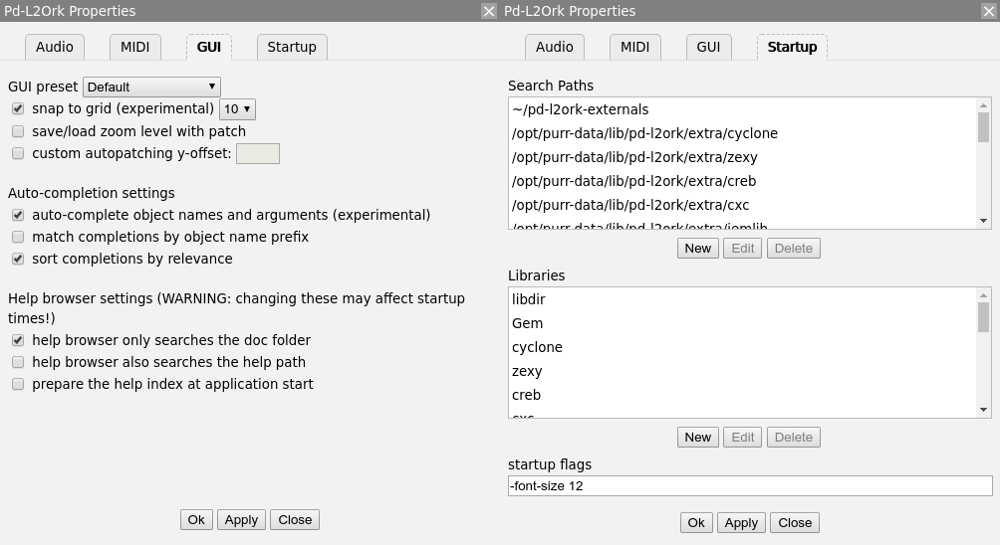
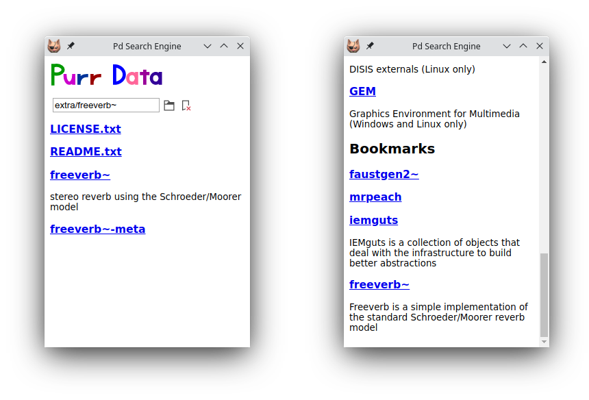

# Meet the Cat: A Quick Introduction to Purr Data

Albert Gräf <<aggraef@gmail.com>>  
Computer Music Dept., Institute of Art History and Musicology  
Johannes Gutenberg University (JGU) Mainz, Germany  
September 2020

This document is licensed under [CC BY-SA 4.0](https://creativecommons.org/licenses/by-sa/4.0/).
Other formats: [Markdown](Purr-Data-Intro.md) source, [PDF](Purr-Data-Intro.pdf)  
Permanent link: <https://agraef.github.io/purr-data-intro/>

**Purr Data** a.k.a. **Pd-l2ork 2** is an improved version of Miller Puckette's interactive computer music and multimedia software **Pd**. This document provides new or prospective Purr Data users with a gentle introduction to the program and some helpful information to get started.

## What is Purr Data?

**[Purr Data](https://git.purrdata.net/jwilkes/purr-data)** is the latest (2.x) branch of Ivica Ico Bukvic's Pd-l2ork. **[Pd-l2ork](http://l2ork.music.vt.edu/main/make-your-own-l2ork/software/)** in turn is a fork of Hans-Christoph Steiner's **[Pd-extended](http://puredata.info/downloads/pd-extended)**, which has been the longest-running (and arguably the most popular) variant of Miller Puckette's Pd. **[Pd](http://puredata.info/)** a.k.a. **Pure Data**, the common basis of all these variants, is Miller Puckette's interactive and graphical computer music and multimedia environment. Pd is also the premier open-source alternative to Cycling74's well-known commercial **[Max](https://cycling74.com/)** program (whose original version was also developed by Miller Puckette when he was at IRCAM in the 1980s). There are a few other popular and very capable applications in the realm of computer music and media art, most notably **[Csound](http://csound.github.io/)** and **[SuperCollider](http://supercollider.github.io/)**. But Max and Pd's special appeal is that you work in an intuitive graphical "patching" environment which allows you to put together advanced real-time signal processing applications without having to learn a "real" programming language.

Puckette's version of the program is sometimes jokingly referred to as **"vanilla"** Pd, because it comes without any extras and thus provides the purest taste of Pd, you might say. In keeping with this metaphor, the other Pd variants are often called **flavors**.

While vanilla Pd, being the reference implementation, remains critically important for the development of Pd's real-time engine, its Tcl/Tk-based graphical user interface has never been very pretty or convenient. Consequently there have been several attempts by the community to improve Pd's user interface in various ways. Pd-extended is the earliest and the longest-running of these, which also includes a fairly complete selection of 3rd party add-ons. However, its development has stopped in 2013 due to lack of contributions, and thus it receives no more bugfixes and updates of the real-time engine.

Ico Bukvic introduced **Pd-l2ork** in 2010 as a fork of Pd-extended to be used by the "Linux Laptop Orchestra" (L2Ork) he founded at the School of Performing Arts at Virginia Tech. Although the original motivation was to create an improved version of Pd-extended to be used by the L2Ork (hence the name) as well as in education, on Linux it quickly became a more up-to-date alternative to Pd-extended offering a fair number of additional bug fixes and GUI improvements. This is mainly due to its more nimble development model which allows bugfixes and improvements to be deployed quickly even if this may have an impact on backwards compatibility. Vanilla Pd, on the other hand, necessarily has a much firmer outlook on backwards compatibility, so that it is still able to run *very* old patches created with ancient Pd versions.

Despite the many and substantial improvements it offers, Pd-l2ork's GUI is still based on Tcl/Tk. This is both good and bad. The major advantage is compatibility with vanilla Pd. On the other hand, Tcl/Tk looks and feels outdated in this day and age, even when going to some lengths with theming, as Pd-l2ork does. Tcl is a rather basic programming language, and its libraries have been falling behind, making it hard to integrate the latest advancements in GUI, multimedia and web technologies. Also, Pd-l2ork's adoption was hampered by the fact that it was essentially tied to Linux, and thus a cross-platform solution was needed.

In 2015 Jonathan Wilkes stepped in and started creating **Purr Data** to address these problems. In a nutshell, Purr Data is Pd-l2ork with the Tcl/Tk GUI part ripped out and replaced with modern web technology. To these ends, it uses an open-source framework called [nw.js](https://nwjs.io/) a.k.a. "node-webkit", which is essentially a stand-alone web browser engine ([Chromium](http://www.chromium.org/)) combined with a JavaScript runtime ([Node.js](http://nodejs.org/)). While the latter was originally invented for developing server-side web applications, frameworks like nw.js allow the two to be used in concert to create fully-fledged and portable desktop applications. Using nw.js ensures that Purr Data runs on Linux, Mac and Windows, looking the same on all supported platforms, and it paves the way to leverage standard web technologies such as [JavaScript](https://en.wikipedia.org/wiki/JavaScript), [HTML5](https://www.w3.org/TR/html5/), [CSS3](https://www.w3.org/Style/CSS/) and [SVG](https://www.w3.org/TR/SVG/).

Purr Data's GUI is written entirely in JavaScript, which is a much more advanced programming language than Tcl with an abundance of libraries and support materials. This makes the further development of Purr Data's graphical user interface a lot easier now that the initial GUI port is done. Patches are implemented as HTML5 SVG documents which offer better responsiveness and graphical capabilities than Tk windows. They can also be themed using CSS and zoomed like any browser window, improving usability. Purr Data also looks better and is easier on the eyes than Pd-l2ork, let alone vanilla Pd, especially on high-dpi displays (cf. [@fig:fig1]).

{#fig:fig1}

Purr Data's nw.js GUI also has some disadvantages. First, some of the included externals still rely on Tcl code, so their GUI features will not work in Purr Data until they get ported to the new GUI. Second, the size of the binary package is considerably larger than with Pd-l2ork or Pd-extended since it also includes the full nw.js binary distribution. (This is a valid concern with many of the so-called "portable desktop applications" being offered these days, but in the case of Purr Data it is mitigated by the fact that its Pd-l2ork base is not exactly a slim package either.) Third, the browser engine has a much higher memory footprint than Tcl/Tk which might be an issue on embedded platforms with *very* tight memory constraints. While none of these issues should normally be a real show-stopper on the supported platforms, it is worth keeping them in mind.

Finally, Purr Data is still comparatively young, but its basis is the tried and proven Pd-l2ork, the present release has been thoroughly tested and many bugs have been ironed out, so it is certainly ready for day-to-day use. It also offers some really compelling advancements over its predecessors. If you have been looking for a modern and actively-maintained successor of Pd-extended, this is it.

## The Name?

Purr Data is the official nickname of the Pd-l2ork 2.x branch. To quote chief developer Jonathan Wilkes from his initial announcement on the [Pd forum][]:

> I've nicknamed it "Purr Data", because cats.

[Pd forum]: http://forum.pdpatchrepo.info/topic/9956/gui-port-of-pd-l2ork-alpha-0-release

Quite obviously the name is a play on "Pure Data" on which "Purr Data" is ultimately based. It also raises positive connotations of soothing purring sounds, and makes for a nice logo.

We also refer to Bukvic's original Pd-l2ork version as Pd-l2ork 1.0 or "classic" Pd-l2ork. Note that Purr Data still clearly shows its Pd-l2ork heritage. It shares a lot of code with Pd-l2ork (essentially all the non-GUI parts), and the executable, library directory etc. are all still named pd-l2ork as well.

\begin{center}\includegraphics[width=20mm]{purr.png}\end{center}

## Where to Get It

Jonathan Wilkes maintains the Purr Data sources in GitLab at <https://git.purrdata.net/jwilkes/purr-data>. There's also a mirror of this repository at Github which serves as a one-stop shop for the latest source and the available releases, including pre-built packages for **macOS** and **Windows**. You can find this at <https://agraef.github.io/purr-data/>. The latest packages are available at <https://github.com/agraef/purr-data/releases>. The Mac and Windows packages should be self-contained. The Windows package is distributed as an installer executable (.exe file). Normally you can just run this package by double-clicking it in your file manager, and walk through the installation procedure. The Mac package is distributed as a disk image (.dmg file); double-clicking the disk image in Finder opens a new Finder window, in which you can drag the application to your Application folder.

**Linux users:** At JGU we maintain a collection of Linux packages for Arch Linux (via the [Arch User Repositories](https://aur.archlinux.org/) a.k.a. AUR) and recent openSUSE, Debian and Ubuntu releases (via the OBS a.k.a. [Open Build System](https://build.opensuse.org/project/show/home:aggraef)). The OBS also offers binary packages for Arch Linux. More information and installation instructions can be found at the [Installation](https://github.com/agraef/purr-data/wiki/Installation#linux) wiki page. Besides Purr Data, these repositories also contain the "classic" Pd-l2ork. Moreover, two additional programming extensions for Pd are available which enable you to run [Faust](http://faust.grame.fr/) and [Pure](https://agraef.github.io/pure-lang/) externals in Pd-l2ork and Purr Data. The JGU packages also offer the advantage that they let you install both classic Pd-l2ork and Purr Data on the same system.

Of course, it is also possible to build Purr Data from source. With the latest additions to the build system, this task has become a lot less daunting than it used to be, and the Purr Data website has some [instructions](https://agraef.github.io/purr-data/#building-from-source). However, because of the large number of included externals, the build process is rather involved, requires a lot of 3rd party dependencies, and takes quite a while even on modern high-end hardware. Therefore, unless your system isn't officially supported or you have specific requirements forcing you to compile from source, we recommend using the available binaries.

## Getting Started

Once you've installed Purr Data, you can launch it from the desktop environment as usual. On Linux, you can just run `pd-l2ork` from the command line, or look in your desktop environment's program menu or launcher for the `Pd-L2Ork` entry and click on that.  (If you installed Purr Data from one of the JGU packages, use the `purr-data` command or the `Purr-Data` desktop icon instead.)

On macOS and Windows, double-click on the application icon, normally to be found in the Application folder on macOS and on the desktop on Windows. (If you didn't create a desktop icon during the Windows installation, look for `Purr-Data` in the start menu.) 

You can also right-click on a patch (.pd) file, choose "Open With" and then select Pd-l2ork or Purr Data to open the patch in Purr Data. This may require a first-time setup to associate the .pd file type with the Purr Data program, however. Most desktop environments will also let you set Purr Data as the default application for .pd files, so that you can subsequently open patch files simply with a double-click. The details of this are system-specific; usually right-clicking the file and choosing `Properties` or some similar option (`Get Info` on macOS) will give you a dialog which allows you to change the file association.

In any case, Purr Data should then launch its main "console" window which logs all messages from the program. If you opened a patch file, it will be shown in a separate "canvas" window.

Purr Data understands basically the same set of command line options as vanilla Pd or Pd-l2ork. On Linux, you can find out about these by running `pd-l2ork -help` (`purr-data -help` when using the JGU packages) from the command line. (This isn't easy to do on Mac and Windows, since the program executable is stowed away somewhere in the application folder.) Some common options which can be placed into the startup flags are `-path` and `-lib`, see section [GUI and Startup Options] below.

### Single Application Instance

Unlike vanilla Pd, Purr Data normally runs as a *single application instance*. If you load additional patch files (by invoking the `pd-l2ork` executable or by clicking patch files in the file manager), they will be opened as new canvas windows in that single unique instance. This prevents the kind of confusion which often arises with vanilla Pd if you accidentally open different patches in different instances of the application. Pd requires that patches are loaded in the same program instance if they are to communicate via Pd's built-in messaging system (send/receive), or if you'd like to copy/paste subpatches between them using the internal clipboard. In its default configuration, Purr Data makes sure that this is always the case.

### Multiple Application Instances

As of version 2.3.2, Purr Data can also be invoked with the `-unique` flag to create multiple application instances. On Linux, you can do this by just specifying the `-unique` option on the command line or by editing the desktop icon you use to launch Purr Data. On Mac and Windows (as well as Linux), you can put this option into the startup flags in the preferences, see section [GUI and Startup Options] below. (Don't forget to remove the option from the startup flags again when it is not needed any more, in order to revert to the normal single application instance behavior.)

For most applications this shouldn't be needed, and the single application instance will be most convenient. But there are some situations in which you will want to run several instances of Purr Data instead. Because Purr Data's real-time processing is all done in a single process associated with the application instance, a single application instance cannot take advantage of the multi-processing capabilities on modern multi-core systems. Some common use cases for multi-processing are if your Pd application involves both audio and graphics processing (typically using the Gem library), or if you have several independent audio processes which you'd like to be run in parallel. In such cases you will want to use the `-unique` option to launch two or more instances of Purr Data, each with their own sets of Pd patches which will then run on different instances of the real-time engine.

## Configuration

When you launch Purr Data for the first time, most likely you will have to configure some things, such as the audio and MIDI devices that you want to use. Like Pd-l2ork, Purr Data provides a central "Preferences" dialog which lets you do this in a convenient way.

### Audio and MIDI Devices

The screenshot in [@fig:fig2] shows how the "Audio" and "MIDI" tabs in this dialog look like on the Mac. For most purposes it should be sufficient to just select the audio and MIDI inputs and outputs that you want to use from the corresponding dropdown lists. Pressing the `Apply` button applies the settings *without* closing the dialog or saving the options permanently. If you want to make your changes permanent, you must use the `Ok` button instead. This also closes the dialog.

You can redo this procedure at any time if needed. Note that it is usually possible to select multiple input and output devices, but this depends on the platform and the selected audio/MIDI back-end or "API". Also note that on Linux (using the ALSA API), the MIDI tab will only allow you to set the number of ALSA MIDI input/output ports to be created; you then still have to use a MIDI patchbay program such as [qjackctl](https://qjackctl.sourceforge.io/) to connect these ports to the hardware devices as needed.

{#fig:fig2}

The setup on Windows works in a similar fashion. More information for Linux users can be found in the [wiki](https://github.com/agraef/purr-data/wiki/Installation#linux-users).

One pitfall of the Pd engine is that it does not rescan the devices if you connect new external audio or MIDI gear while Purr Data is already running. Thus you need to relaunch the program to make the new devices show up in the preferences. In the case of MIDI, it is easy to work around this limitation by employing virtual MIDI devices, which ALSA MIDI does by default. On the Mac you'd use the [IAC](https://sites.google.com/site/mfalab/mac-stuff/how-to-use-the-iac-driver) devices, on Windows a MIDI loopback driver such as [loopMIDI](http://www.tobias-erichsen.de/software/loopmidi.html) for that purpose. You then wire these up to the MIDI hardware using a separate patchbay program. A similar approach is possible with audio loopback software such as [Jack](http://www.jackaudio.org/).

### GUI and Startup Options

The GUI theme can be selected on the "GUI" tab (see [@fig:fig3], left). The changes will be applied immediately. Purr Data provides various different GUI themes out of the box. Note that the GUI themes are in fact just CSS files in Purr Data's library directory, so if you're familiar with HTML5 and CSS then you can easily change them or create your own. In Purr Data version 2.14.1 and later, the "grid background in edit mode mode" option enables the edit mode grid, which helps positioning objects and lets you see at a glance when edit mode is active. (As of Purr Data version 2.16.0, this option has been replaced with the "snap to grid" option which actually places objects on grid points.) Another useful option on the GUI tab is "save/load zoom level with patch". Purr Data can zoom any patch window to 16 different levels, and this option, when enabled, allows you to store the current zoom level when a patch is saved, and then later restore the zoom level when the patch gets reloaded. The remaining options on the GUI tab are related to the help browser, we'll discuss these in section [Configuring The Help Browser] below.

{#fig:fig3}

The final tab in the preferences dialog is the "Startup" tab ([@fig:fig3], right), which lets you edit the lists of library paths and startup libraries, as well as the additional options the program is to be invoked with. By default, Purr Data loads most bundled external libraries at startup and adds the corresponding directories to its library search path. If you don't need all of these, you can remove individual search paths and/or libraries using the "Search Paths" and "Libraries" lists on the Startup tab. Just click on a search path or library and click the `Delete` button. It is also possible to select an item and add your own search paths and external libraries with the `New` button, or change an existing entry with the `Edit` button.

At the bottom of the Startup tab there is a "startup flags" field which lets you specify which additional options the program should be invoked with. This is commonly used to add options like `-legacy` (which enforces bug compatibility with vanilla Pd) as well as the `-path` and `-lib` options which provide an alternative way to add search paths and external libraries. For instance, to add JGU's Pure and Faust extensions to the startup libraries, the Startup Flags field may contain something like the following: `-lib pure -lib faust/pdfaust`

Any desired startup options can be set that way, i.e., anything that Pd usually accepts on the command line. However, note that the startup flags require that you relaunch Purr Data for the options to take effect (the same is true if you change the list of startup libraries). Also, while setting paths and libraries via the startup flags is often convenient, there are some downsides to having these options in two different places, see ["Sticky" preferences] in the [Tips and Tricks] section below.

As with the other configuration options, remember to press the `Ok` button in order to have your changes recorded in permanent storage. This will also close the dialog.

Finally, note that if your configuration gets seriously messed up, there are ways to reset Purr Data to its default configuration, see [Resetting the preferences] in the [Tips and Tricks] section.

## Getting Help

The best way for new users to learn how to use Purr Data, and Pd in general, is its excellent integrated help system. This is really one of the hallmark features of the Pd program, no matter which flavor you use. Purr Data's help system offers hundreds of help patches covering many different areas, and these help patches are not just documentation, they are *real* Pd patches which you can run to try them out, and then copy and paste relevant parts to your own patches.

It is worth noting here that Purr Data, like Pd-l2ork, continues to build on the Pd-extended documentation efforts. This includes over 200 new and updated help files, including the cyclone library documentation. All of the new help files provide supporting meta info contained within the META subpatch (which is needed, in particular, to enable keyword searches), following the standards set by the Pd documentation project (PDDP). This is an ongoing effort, however, and so not all help patches have been converted yet.

While the sheer amount of help patches can be overwhelming at first, there are some sections in the documentation which are organized as tutorials, so that you can work through them step by step. This includes all the help patches that go along with Miller Puckette's comprehensive book ["Theory and Techniques of Electronic Music"](http://msp.ucsd.edu/techniques.htm), which are still the best way to get to grips with Pd. If you are new to Pd, we recommend that you work at least through the sections "Control Tutorials" and "Audio Tutorials", and *really* try to understand what's going on in these patches. With a complex software like Pd, it's all too easy to fall victim to "cargo cult" habits if you just blindly copy parts of other people's patches. You should resist that temptation, at least until you have a solid foundation under your belt, and those two sections will provide you with that.

Purr Data's central point of entry to the help system is its *Help Browser*, discussed below. In addition, as with other Pd flavors, it is also possible to open the help patch for an object by just right-clicking on that object in a patch and choosing the "Help" menu item. 

### The Help Browser

Using the Help / Help Browser menu option (shortcut: ctrl + B, or cmd + B on the Mac) fires up Purr Data's help browser, which looks deceptively simple (see [@fig:fig4]) and is actually quite easy to use, but offers a lot of functionality under the hood. You can search for object names or keywords by typing them in the search entry field at the top of the browser, or you can browse the available documentation sections in the browser's *home screen*, which is what gets shown initially below the search entry, by just clicking on one of the section titles.

{#fig:fig4}

On the right in [@fig:fig4] you can see how the display changes after you entered some search terms like "audio devices" and hit Enter. As indicated, you can enter multiple search terms and they will all be searched for in one go (which amounts to matching any of the given search terms, i.e., all patches will be shown for which at least one of the search terms matches). The found help patches will be shown in the list (with short descriptions of the patches if available). You can then click on one of the patches to open it in a canvas window. Clicking on the "x" symbol in the search entry returns you to the home screen.

The latest version of the help browser now also supports "incremental search", which means that the search results are continually updated as you type, so hitting the Enter key isn't needed any more. At the time of this writing, only the git version of Purr Data, available on Linux through the [JGU preview repositories](https://github.com/agraef/purr-data/wiki/Installation#experimental-and-preview-builds), has this feature; but it should soon become available in the regular releases.

Note that to keep things simple and not to overwhelm novice users with too much information, the search function only covers the "official" documentation (the doc/ hierarchy) by default. There are ways to change the scope of the keyword search in the GUI preferences, see [Configuring The Help Browser] below. But in any case it is also possible to explore all the other help patches which are available in the extra/ hierarchy (which contains all the 3rd party abstractions and externals), by employing the little folder icon to the right of the search entry. This will open a file browser (initially on the doc/ folder) which can then be used to browse *all* the available help patches located *anywhere* on your hard drive. When looking for help patches in the extra/ hierarchy, which is a sibling of doc/, simply navigate to that directory in the file browser and click on one of its subdirectories containing the various abstractions and externals. Double-clicking on a help patch will open the patch in its own window, and then also show the corresponding directory in the help browser, so that additional help patches from the same folder can be accessed without any further ado.

If you already know the name of a subdirectory with interesting help patches, you can also just type its name in the search entry (including the doc/ or extra/ prefix) to have the corresponding folder displayed in the help browser. For instance, typing "extra/mrpeach" provides a quick way to access the help patches for the mrpeach externals. If you have help patches which live outside the program directory (e.g., somewhere in your home directory), you can also type an absolute directory name to access these.

Note that in any case, you can always return to the home screen of the help browser by clicking that tiny "x" symbol in the search entry (or by just hitting the Esc key with the cursor located in the field).

### Bookmarks

As of Purr Data 2.14.1, the help browser offers a simple but effective bookmark feature which lets you add directories with Pd patches to the browser's home screen, where they will be shown in their own "Bookmarks" section at the bottom of the home screen.

To add a new bookmark, first navigate to the directory that you'd like to add (using, e.g., the file browser, or by just typing the directory name into the search entry), and then push the little bookmark icon to the right of the file browser icon. A little red cross on the bookmark icon will indicate that the directory has been bookmarked, and that pushing the bookmark icon again will remove that bookmark (see [@fig:fig5], left). The keyboard shortcuts Ctrl+D (Add bookmark) and Ctrl+Shift+D (Remove bookmark) can be used as well.

{#fig:fig5}

You can then press Esc to return to the home screen, where the bookmarked directory will now be shown under the "Bookmarks" section at the bottom of the browser window (you'll probably have to scroll down to see it). Note that the "Bookmarks" section header will only be displayed if there are any bookmarks to show (see [@fig:fig5], right).

The bookmarks are stored in JSON format in the user's configuration directory (which is located in the home directory, i.e., ~/.purr-data on Linux and Mac, and /Users/*username*/AppData/Roaming/Purr-Data on Windows). This file is in a human-readable and easily editable format, so if needed you can rearrange your bookmarks to your liking by editing this file in your favorite text editor.

### Configuring The Help Browser

The GUI tab in the preferences dialog (cf. [GUI and Startup Options] and [@fig:fig3], left) offers some options to configure the scope of the keyword search. Note that in order to perform keyword searches, the help browser first needs to construct an index of all the help patches and their keywords. This is either done on the fly, when the help browser is first opened during a Purr Data session (this is the default), or when the application is launched (there's a checkbox which lets you enable this). As of Purr Data 2.14.1, the help index is cached in the user's configuration directory (see [Bookmarks] above) and only rebuilt from scratch when needed (i.e., if the contents of the indexed directories changes).

Once the browser has been launched for the first time and the index has been built and cached, it will always come up quickly on subsequent invocations. But depending on how many patches you are indexing, creating the index on first launch may take a while (anywhere from less than a second to several seconds on modern hardware), so changing these options *will* have an impact on indexing time. This should not be much of a problem because the indexing will only have to be done once (after a fresh install or an upgrade of Purr Data). But if you rarely use the help browser at all, then you may want to ensure that the "prepare the help index at application start" option is unchecked (which is the default). Moreover, there are two options which let you change the scope of indexed patches (changing these options will take effect as soon as you relaunch the help browser, and trigger creation of a new index file):

- If "help browser only searches the doc folder" is checked (which is the default), then keyword searches are confined to the doc/ hierarchy. This is the fastest option and will be sufficient for novice users at least, as it covers all the official documentation that ships with Purr Data. However, if you're an expert user and frequently use 3rd party externals living in the extra/ hierarchy, then you may want to uncheck this option to have all the remaining subdirectories in the pd-l2ork library directory indexed as well (note that this may slow down the indexing on first launch considerably).

- The "help browser also searches the help path" option, when checked, lets you tailor the keyword search to the externals you're working with, so that you won't be swamped with keyword matches from externals you never use. These externals may be located anywhere you choose, including the extra/ hierarchy, but note that if you've already unchecked the "help browser only searches the doc folder" option, then there's no need to also explicitly add subdirectories of extra/. In either case, the directories to be searched with this option are set using Purr Data's *help path* (having them in the library search path is *not* enough). You do this using Purr Data's `-helppath` option which can be added to the "startup flags" field at the bottom of the Startup tab. E.g., on Linux you may want to add something like `-helppath ~/pd-l2ork-externals` (that directory is often used on Linux for custom and personal external collections).

**Caveat:** Again, be warned that changing these options and then installing external collections with gazillions of patches into either the extra/ hierarchy or on your personal help path may have a very negative impact on first launch times, since all these patches will have to be scanned during index creation.

## Pd-l2ork and Purr Data Goodies

Compared to vanilla Pd, Pd-l2ork and Purr Data provide a comprehensive set of new and improved features, way too many to even just mention them all, so we refer the interested reader to the [PdCon 2016 paper](http://ico.bukvic.net/PDF/PdCon16_paper_84.pdf) for details. The paper also covers the history and motivation of the Pd-l2ork project.

One of Pd-l2ork's major advancements, which has only recently been ported to vanilla Pd, is its *infinite undo* capability, which makes it easy to revert accidental changes without having to worry about taking snapshots of patches while they're under development. A helpful change also worth mentioning here is the improved *tidy up* option in the Edit menu, which first aligns objects and then spaces them equidistantly. Many of the other new features are simply GUI and usability improvements which quickly become second nature to the user, such as the graphical improvements, the ability to resize the IEM GUI elements and "graph on parent" areas using the mouse, and the extended key bindings for number and number2 objects.

Other features will be more useful for advanced users, like the reflection capabilities (see the `pdinfo`, `canvasinfo`, `classinfo` and `objectinfo` help patches) and the new SVG elements for data structure visualizations. The latter have been considerably enhanced in Purr Data, see the "Pd-L2Ork Data Structures" section in the help browser. They also make it possible to create your own custom GUI elements in plain Pd, without having to learn a "real" programming language.

### Intelligent Patching

Another big time-saver is Pd-l2ork's *intelligent patching* facility, which lets you select two or more objects in order to connect multiple outlets and inlets in one go. A similar feature was recently added to vanilla Pd, but Pd-l2ork has had this for a long time. In Pd-l2ork and Purr Data, intelligent patching offers a number of different modes:

- If you select *exactly* two objects A and B, say, and then connect one of the outlets from A to one of the inlets of B, then starting from the initial outlet-inlet pair the remaining outlets of A will be connected to the corresponding inlets of B.

- If you select two (or more) objects B and C, say, and then connect an outlet of a third, *unselected* object A to an inlet of B, then the corresponding connection from A to C will be done automatically. Conversely, you can also connect an outlet of B to an inlet of A to have the corresponding C-A connection completed for you.

- If you select *three* (or more) objects A, B and C, say, where A has two outlets or more, and then connect an outlet of A to an inlet of B, then the *next* outlet of A will be connected to the corresponding inlet of C. Conversely, you can also connect an outlet of B to an inlet of A, and have the corresponding outlet of C connected to the next inlet of A. This works for an arbitrary number of source or target objects, considering the "other" objects in left-to-right, top-to-bottom order.^[This operation works best if the "other" objects only have a single out- or inlet, since that makes the outcome unambiguous. Otherwise Purr Data will often prefer creating outgoing connections, in which case you'll have to hold down the Ctrl key to enforce incoming connections.]

- Finally, pressing the shift key while doing connections will let you do multiple connections from the same outlet in one go.

Purr Data has a help patch for this incredibly useful facility, which I have also provided with this document in the [intelligent-patching.pd](intelligent-patching.pd) patch for your perusal. In the comments, the patch also includes detailed explanations of all the different intelligent patching modes, and you can find some subpatches with exercises in the margin of the main patch.

### Subpatch and Abstraction Features

A recent addition are the extended subpatch and abstraction creation and saving facilities, which were contributed by Guillem Bartrina during the Google Summer of Code 2020:

- A new "Encapsulate" option in the Edit menu lets you turn a collection of selected objects into a corresponding one-off subpatch in a fully automatic way. This finally makes creating one-offs from parts of your patches a very quick and easy operation.

- You can also turn an existing one-off subpatch into an abstraction simply by right-clicking on the object and choosing the new "Save as" option from the context menu. This will also give you the option to replace the existing subpatch, as well as all its other instances with the newly created abstraction.

- There's a new [ab] object, to be invoked as [ab name args ...], which lets you create *private abstractions*. These are embedded in their parent patch just like a one-off subpatch [pd name], but otherwise behave like real abstractions in that they have their own `$0` and can have arguments, too. So they work just like the plain old abstractions, but become a part of your main patch, pretty much like the subroutines of a C program. This makes shipping a patch much more convenient, as you don't have to send a bunch of abstraction files along with it any more.

- The [ab] object is accompanied by a number of supplemental objects (abinfo, abdefs, abclone) which let you inspect and clone private abstractions. There's also an "Abstractions" dialog which can be accessed via the Window menu. This will give you a quick overview of the private abstractions contained in a patch. Also, it will show you private abstractions which aren't currently being used (i.e., don't have any instances), so that you can select and then delete them if they aren't needed any more.

## Purr Data and Pd-Lua

As of version 2.5, Purr Data includes the latest version of Claude Heiland-Allen's excellent [Pd-Lua](https://agraef.github.io/pd-lua/) extension for embedding the [Lua](http://www.lua.org/) scripting language in Pd. This provides you with an easy means (much easier than Pd's native C interface) to write your own custom Pd objects if they require the use of a real programming language offering loops, functions and complicated data structures.

Lua is perfectly suited for this purpose, because it is light-weight and easily embeddable by design. It is also small and easy to learn, yet very capable, offering a complete range of imperative, object-oriented and functional programming language elements. Like Pd, Lua is an interpreted language featuring dynamic typing, which makes interfacing between Pd and Lua quite easy.

Pd-Lua requires Lua 5.2, 5.3, or 5.4, which should be readily available in all Linux distributions (on Mac and Windows the requisite Lua library is included in the installer). There's a [tutorial](https://agraef.github.io/pd-lua/tutorial/pd-lua-intro.html) available to get you started, and a fairly extensive collection of examples can be found in the extra/pdlua/examples folder.

## Tips and Tricks

We conclude this introduction with a little grab bag of helpful tips and tricks. If your questions aren't answered here, please post them to the DISIS [Pd-l2ork mailing list](http://disis.music.vt.edu/listinfo/l2ork-dev).

### Edit Mode and Temporary Run Mode

*Temporary run mode* is a facility present across different Pd flavors which allows you to quickly switch to run mode (where you can operate GUI elements in a patch) while in edit mode (where you can edit the patch). In vanilla Pd, as well as most other Pd flavors, this is activated by pressing and holding the Ctrl modifier key (or the Cmd key on the Mac).

In Purr Data, the modifier was changed to the Alt key in version 2.14.1, because the Ctrl key binding caused some conflicts with the menu shortcuts. This resulted in some rather serious regressions in the GUI, such as some menu keybindings not working in the expected way or interfering with edit mode.

Apart from having to get accustomed to the new key binding, this also implies a potential issue for Linux users, because many Linux desktop environments use Alt-click to initiate a window move action, which will interfere with temporary run mode. You have this issue if you try to operate GUI elements with a click-drag action while holding the Alt key, only to find that this moves the patch window instead. In order to make temporary run mode work again, make sure to rebind the window-move action to a different modifier key and/or mouse button, such as Meta+click or Alt+middle-click which are rarely used by window managers, at least not for important actions.

Version 2.14.1 also introduced the *edit mode grid* as a better means to indicate that edit mode is active, while also being useful as a positioning aid. The grid is enabled by default, but can be turned off in the GUI preferences if you don't want/need it.

### Install classic Pd-l2ork alongside Purr Data

On Linux there are some situations where you may want to run *both* classic Pd-l2ork and Purr Data on the same system. This may be useful, e.g., if you need some feature of Pd-l2ork like its K12 mode which hasn't been ported to Purr Data yet. In order to do this, you need one of the JGU packages of Purr Data (see [Where to Get It] above). These will install into a separate directory (normally `/opt/purr-data`) so that the pathnames of the binaries and libraries in the package do not clash with those from a classic Pd-l2ork installation under `/usr`. The desktop icons will be named differently as well, and a symbolic link named `purr-data` will be created in the `/usr/bin` directory. The link points to `/opt/purr-data/bin/pd-l2ork` and lets you run Purr Data from the command line without having to specify the full path to the executable.

### Installing externals

Purr Data already bundles many if not most of the 3rd party externals commonly used by Pd users. To add even more, there are some special directories into which you can install the externals so that Purr Data finds them. This is basically the same as with Pd-extended, but the directories are named differently so that you can keep the Purr Data externals separate from the vanilla/extended ones if needed. There's always one location for system-wide and another one for personal installation. The precise locations and names of these directories depend on your platform:

- Linux: `/usr/local/lib/pd-l2ork-externals` for system-wide, `~/.local/lib/pd-l2ork/extra` and `~/pd-l2ork-externals` for personal installation
- Mac: `/Library/Pd-l2ork` for system-wide, `~/Library/Pd-l2ork` for personal installation
- Windows: `%ProgramFiles%\Common Files\Pd-l2ork` for system-wide, `%AppData%\Pd-l2ork` for personal installation; the former is usually under `\Program Files` for the 64 bit and `\Program Files (x86)` for the 32 bit version, and the latter can be found under `\Users\username\AppData\Roaming` on modern Windows systems

Besides these, you can also copy externals to the `extra` subdirectory of your Purr Data application folder, but this folder can be hard to find, and it isn't really recommended to install stuff there, because it makes it hard to figure out which externals you added yourself.

For singleton externals it will usually be enough if you just copy them into one of these folders and then relaunch Purr Data. External libraries containing a collection of different externals, on the other hand, will typically require that you also load the library at startup, using the available startup configuration options in the preferences (see [GUI and Startup Options] above). 

### Resetting the preferences

It happens to the best of us that we mess up our Pd configuration so badly that it is beyond repair. In such a case you probably want to go back to Purr Data's default setup and start from a clean slate again. While Purr Data's preferences dialog does not provide a button for this (yet), there are other ways to accomplish this. They depend on the particular platform, however.

- On Linux, do `rm -rf ~/.purr-data` in the terminal.

- On the Mac, do `rm ~/Library/Preferences/org.puredata.pd-l2ork.plist` in the terminal.

- On Windows, the easiest way is to just reinstall the Purr Data package and make sure that you remove the previous installation when prompted. This will also clear out the registry entries and leave you with the default configuration. However, you can also launch the `regedit` program and manually remove the `HKEY_CURRENT_USER\Software\Purr-Data` or `HKEY_LOCAL_MACHINE\Software\Purr-Data` registry key and all its subkeys.

Then just relaunch Purr Data. Your preferences should now be in pristine state again, and all the default search paths and startup libraries will be restored. Your audio and MIDI device configuration, and the other bits and bobs that you changed in the preferences will be gone as well, so you'll have to redo those.

### "Sticky" preferences

One pitfall with Purr Data's preferences system (which it shares with its predecessors) is that some options in the startup flags may override other changes done manually in the preferences dialog, and will then appear to "stick" when you relaunch Purr Data. E.g., if a library gets loaded via the `-lib` option in the startup flags, it will *also* show up in the list of libraries next time you run Purr Data. But if you just remove it there, and not also in the startup flags, then the library will *still* be loaded next time you run Purr Data. The same caveat applies if you have some options setting up aspects of the audio and MIDI configuration in the startup flags and then reconfigure your devices in the Audio and MIDI tabs of the dialog. Thus, if Purr Data appears to stick to a certain audio or MIDI setup even though you're certain that you set (and saved) a new configuration, check the startup flags, they're almost certainly to blame. (Another possible culprit are the Linux desktop files, see below.) 

This irritating behavior is due to how Pd handles the startup flags, especially flags which may override some behavior in other configuration options. The easiest way to get rid of all these mishaps is to remove the relevant options in the startup flags (when in doubt, just delete them all so that the startup flags field is completely empty) and save your options by clicking `Ok` in the preferences dialog.

Sometimes options may seem to stick even if the startup flags field is in fact empty, so that the preferences dialog appears to be partially dysfunctional. This is almost certainly due to some stray startup options in the application's desktop files, most likely on Linux (Pd-l2ork's original desktop files, which Purr Data inherited in the Linux version, seem to be the main culprit here). Remove the offending options in the desktop icons that you use to launch Purr Data, then this will go away. (Again, when in doubt, just remove *all* of the extra options in the desktop file, so that just the program name remains; none of these options are essential for Purr Data's proper operation.)

### Purr Data hangs during startup

As far as I can tell, this was only reported on macOS so far. The symptom is that the GUI launches, but then hangs during the startup sequence after printing the message `incoming connection to GUI` in the console window. The GUI then becomes totally unresponsive, eating up 100% cpu, and the only way to get rid of it is killing it ("force quit").

The exact causes are unknown right now, but it seems that this behavior may be caused by bad 3rd party externals causing the realtime engine to hang or crash during startup. The GUI then waits for the incoming connection from the engine which never gets established, which makes it hang in turn.

As it's impossible to launch the GUI and remove the offending external in the preferences dialog in this rather unfortunate situation, the only known solution to this problem is to reset the configuration (see [Resetting the preferences] above), after which Purr Data hopefully launches without any hitches again. If you're feeling adventurous, you may then start adding your local externals one by one until the GUI hangs again, at which point you will have identified the culprit, so that you can remove it from your system.

### Purr Data starts up very slowly

Again, this seems to be a Mac-specific issue. Older (pre-2.0) Mac versions of Purr Data had the defect that old search paths and startup libraries from previous installations would keep piling up in the configuration until eventually Purr Data's startup would become *very* slow. This has been fixed in the 2.0 version (and startup time on the Mac has generally been improved as well), but if you're still using an old configuration from the pre-2.0 days, then you might still see remnants of this issue even in the 2.0 version.

One thing you can try in this case is to launch the preferences dialog, press `Ok` and then quit and relaunch Purr Data. If that doesn't help, reset the configuration as explained under [Resetting the preferences] above. (If that doesn't help either, then you probably have a different issue which you should report on Purr Data's [issue tracker](https://git.purrdata.net/jwilkes/purr-data/issues).)

### Legacy Tcl commands in externals

Every so often you may run into warnings about "legacy Tcl commands" in Purr Data's console window which typically look like this:

~~~
legacy tcl command at 201 of ../shared/hammer/file.c: hammereditor_close .86439b0 0
~~~

In most cases these should be harmless, but they may indicate a missing piece of GUI functionality due to Tcl code which has not been ported to Purr Data's new nw.js GUI yet. In any case, feel free to report such messages at Purr Data's [issue tracker](https://git.purrdata.net/jwilkes/purr-data/issues), so that hopefully someone from the development team can look into them. A proper bug report should at least include the message itself and the Pd object it relates to. If some special steps are needed to reproduce the message, you should report these as well. Also, please do make sure *first* that the specific message you're seeing has not been reported in the issue tracker already.
